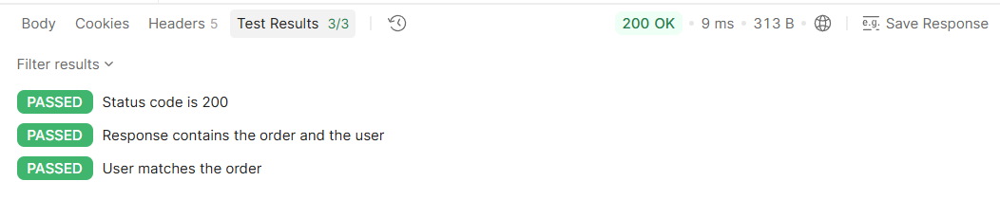
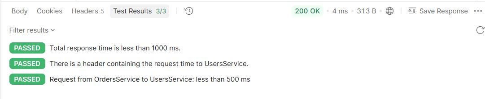
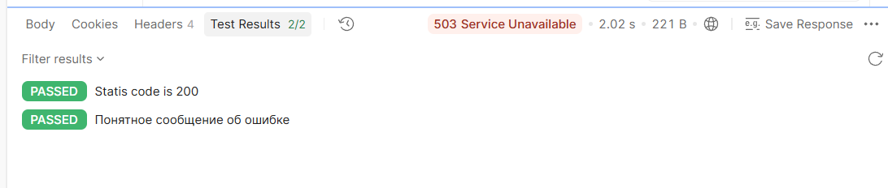

# Сервисы работают

### Get Заказы с данными и пользовалетля 
```js
pm.test("Status code is 200", function () {
    pm.response.to.have.status(200);
});

pm.test("Response contains the order and the user", function () {
    const body = pm.response.json();

    pm.expect(body).to.have.property("order");
    pm.expect(body).to.have.property("user");
});

pm.test("User matches the order", function () {
    const body = pm.response.json();

    pm.expect(body.user.id).to.eql(body.order.userId);
});
```


### Get Время отклика 
```c#
pm.test("Total response time is less than 1000 ms.", function () {
    pm.expect(pm.response.responseTime).to.be.below(1000);
});

pm.test("There is a header containing the request time to UsersService.", function () {
    pm.response.to.have.header("X-Users-Service-Time");
});a

pm.test("Request from OrdersService to UsersService: less than 500 ms", function () {
    const time = Number(pm.response.headers.get("X-Users-Service-Time"));

    pm.expect(time).to.be.below(500);
});
```


# UsersService выключен

### Get UsersService недоступен
```js
pm.test("Statis code is 200", function () {
    pm.response.to.have.status(503);
});

// pm.test("Понятное сообщение об ошибке", function () {
//     pm.expect(pm.response.text()).to.include("недоступен");
// });
```

